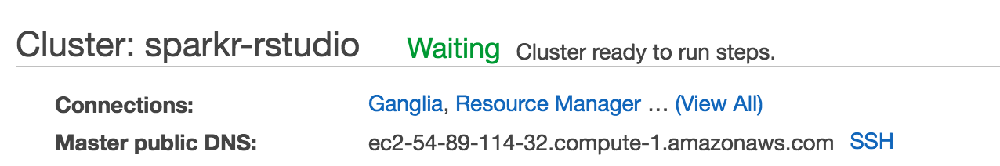

# spark-social-science
Automated Spark Cluster Builds with RStudio or PySpark for Policy Research. 
[Comments welcome on Github or on Twitter @alexcengler]

The goal of this project is to deliver powerful and elastic Spark clusters to researchers and data analysts with as little setup time and effort possible. To do that, at the Urban Institute, we use two critical components: (1) a Amazon Web Services (AWS) CloudFormation script to launch AWS Elastic MapReduce (EMR) clusters (2) a bootstrap script that runs on the Master node of the new cluster to install statistical programs and development environments (RStudio and Jupyter Notebooks). 

This guide illustrates the (relatively) straight forward process to provide clusters for your analysts and researchers. For more information about using Spark via the R and Python APIs, see these repositories:

<ul>
	<li>https://github.com/UrbanInstitute/sparkr-tutorials</li>
	<li>https://github.com/UrbanInstitute/pyspark-tutorials</li>
</ul>

### Security Disclaimer:

I am not a security expert and this guide does not specify security specifics necessary for secure data analysis. There are many important security considerations when doing data analysis in the cloud that this guide does not cover. Please make sure to consult with security experts whenever working in cloud compute.

## Setup 

Just a few steps will get you to working Spark Clusters. We're going to setup the bootstrap scripts first, then the CloudFormation script. Note that all the required changes that you need to make involve replacing text that contains the phrase 'goes-here'. Search for that phrase within the CloudFormation script and bootstrap files to make sure you have replaced all those text fields.

### 1. Setup Your Bootstrap Scripts

Bootstrap scripts run at the start of the cluster launch. We're going to host them in AWS S3, then reference them in our CloudFormation Template. So, everytime we launch a cluster, the bootstrap scripts will run, setting up our statistical environment: either R and RStudio pointed at SparkR, or Python and Jupyter Notebooks pointed at PySpark.

First, create an AWS S3 bucket for your EMR scripts and logs. There are two bootstrap scripts (.sh files) for each of the two environments. You only need to change one thing for these bootstrap scripts to work. Within the file that ends with '_emrv4.sh', simple replace the phrase 'your-bucket-name-goes-here' with the name of the bucket you just created. You then need to take both bootstrap scripts (the one that you just changed that ends in "_emrv4.sh" and the one that ends in "emrv4-proc.sh") for your preferred environment and upload them to your new bucket.

### 2. Setup Your CloudFormation Template

The CloudFormation Script needs a few changes to work as well.

<ul>
	<li>Replace the phrase 'your-bucket-name-goes-here' with the name of the bucket you created a minute ago for your bootstrap scripts.</li>
	<li>Create a new S3 bucket for the logs from your clusters, and replace the phrase "logs-bucket-goes-here" with the name of your new bucket.</li>
	<li>Change the CIDR IP to your organzation's or your personal computer's IP. This will only allow your organizatinor your computer to acces the ports you are opening for RStudio / Jupyter / Ganglia. This is optional, but know that if you do not do this, <font3 color="red">anyone can access your cluster at these ports.</style></li>
</ul>

### 3. Launch a Cluster

<ul>
	<li>Go to CloudFormation on the AWS Dashboard - Hit Create Stack</li> 
	<li>Upload your CloudFormation Script - Hit Next</li>
	<li>On the 'Specify Details' page, you need to make a few changes, though once you have these fiugred out you can add them to the CloudFormation script.</li>
	<ul>
		<li>Create a Stack Name</li>
		<li>Set a Key Pair setup for your account (can set as a default within CloudFormation);</li>
		<li>Set a VPC - the default VPC that came with your AWS account will work;</li>
		<li>Set a Subnet (<a href="https://aws.amazon.com/about-aws/whats-new/2015/12/launch-amazon-emr-clusters-in-amazon-vpc-private-subnets/">can be private or public</a>);</li>
		<li>Set other options as needed, including changing the number of cores, the type of EC2 instances, and the tags (you can, but I don't recommend changing the ports).</li>
	</ul>
	<li>Hit next at the bottom of this screen, add tags if you want on the next screen, and hit Create Cluster.</li>
	<li>Go to your EMR dashboard and grab the DNS for the Master node. The whole string (seen below as 'ec2-54-89-114-32.compute-1.amazonaws.com') is your public DNS. 
		 You should then be able to go to these URLs:
		<ul> 
			<li>RStudio at DNS:4747 - note that RStudio by default needs a username and password. These are set to 'hadoop' for both, and does affect how you are logged into the master node. We have run into errors changing this username and would be happy to hear about an alternative / fix.</li>
			<li>Jupyter Notebooks at DNS:8192</li>
			<li>Ganglia Cluster Monitoring at DNS/ganglia </li>
		</ul>
	</li>
</ul>

## Choosing Between SparkR & PySpark

If you have a strong preference of language for R or Python, you should let that preference guide your decision. Don't feel obligated to choose one over the other based on the impression that one is dramatically different than the other. 
<ul>

<li><b>Speed:</b> All of the APIs (R, Python, and yes, Scala) are communicating with the same API - specifically the Spark DataFrames API. This means that the execution speeds written in any of the three languages are basically the same.</li>

<li><b>Available Functionality:</b> In terms of the Spark functionality available, there are some differences between SparkR and PySpark at present, with PySpark being more fleshed out. However, with the impending release of Spark 2.0 (DataBricks has suggested it will happen in the next few weeks), we expect many of these distinctions to disappear.</li>

<li><b>Code Syntax:</b> I would also say that SparkR feels a bit more like normal R than PySpark feels like Python, although both have peculiarities. This is perhaps the case since R is natively built around dataframes, like Spark’s DataFrame API. If you’re equally competent at R and Python, and don’t think you need third party packages, this might push you towards SparkR. By the way, we oriented all of our tutorials (<a href = "https://github.com/UrbanInstitute/pyspark-tutorials">PySpark</a> / <a href="https://github.com/UrbanInstitute/sparkr-tutorials">SparkR</a>) around the DataFrame API, and strongly recommend that social scientists work through this API (DataBricks makes the same suggestion).</li>

<li><b>Open Source Development:</b> It seems like Python has the advantage here, in that more of the packages extending the functionality come written in or accessible through PySpark than SparkR. This is likely a product of the current Spark community – more data scientists and engineers than more traditional statisticians and social scientists.</li>
</ul>
